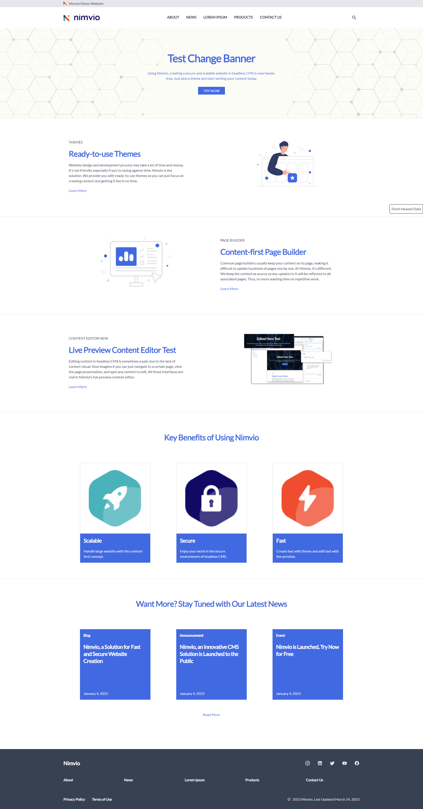

# Nimvio Demo Website (Royal Blue on White)
[](https://nuxt.com/)

## Features
- 📰 Nimvio headless CMS
- 💨 Tailwind CSS for styling
- 🎨 Themeable via `tailwind.config.cjs`
- 📱 Responsive (layout, images, typography)
- ♿ Accessible (as measured by https://web.dev/measure/)
- 🔎 SEO-enabled (as measured by https://web.dev/measure/)

## Nimvio Headless CMS
Royal Blue on White theme is available on Nimvio as one of the many available built-in themes. Starting a new project in Nimvio is as easy as choosing the theme you like, then start editing your content with Nimvio live preview editor. Start your project now in [Nimvio App](https://app.nimvio.com).

If you want to start Nimvio project from scratch, to make this repository work with Nimvio, the contents you created must follow the following pre-defined content template and content structure. 
### Content Tree Structure
```
.
└── Content Root/
    ├── Configuration/
    │   └── Styles/
    │       ├── Default
    |       ├── Nimvio 1
    |       └── Fonts
    |           ├── Tangerine
    |           └── Lato
    ├── Layout/
    │   ├── Layouts/
    │   │   └── Default
    │   └── Placeholders/
    │       ├── Header
    │       ├── Footer
    │       └── Main
    └── Contents/
        ├── Common
        ├── Home
        ├── About
        ├── News
        ├── Articles
        └── Privacy Policy
```    

## Environment Variables
```
#.env.example
NUXT_PUBLIC_APICD_URL=https://api.nimvio.com/cda/graphql/v1
NUXT_PUBLIC_APIES_URL=https://api.nimvio.com/cda/es/v1
NUXT_PUBLIC_PROJECT_ID=Project_832c2b2d-0757-4a0b-b136-bfe388c664d4
NUXT_PUBLIC_PAGE_CONTENT_ID=Content_da6e1b38-02d2-4302-90bb-36a4a8b1720b
NUXT_PUBLIC_STYLE_CONTENT_ID=Content_b459b0b0-e121-414e-8d87-878ae48d1f9a
```

## Commands

| Command                | Action                                            |
| :--------------------- | :------------------------------------------------ |
| `npm install`          | Install dependencies                              |
| `npm run dev`          | Start local dev server at `localhost:3000`        |
| `npm run generate`     | Build your production site to `./dist/`           |